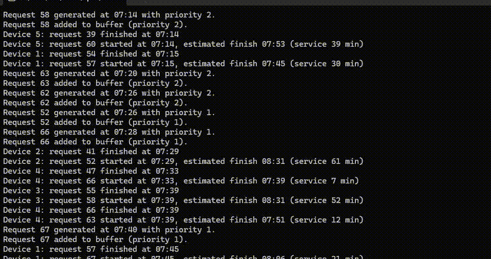

## Mass Service System

**Mass Service System** is a simulation of a queueing system with multiple request producers and consumers. The system includes:

# Producers:
- **Corporate** (2 units)
- **Premium** (4 units)
- **Free** (6 units)

# Request Generation:
- **Daytime:** Probability of request generation = 0.7 per hour
- **Nighttime:** Probability of request generation = 0.2 per hour
- **Transition between day and night** follows a sinusoidal function

# Queue Management:
- **Queue size:** 8 requests
- **Low-priority requests** are discarded when the queue is full
- Requests are queued based on **priority and time of arrival**

# Consumers (GPUs):
- Process requests based on an **exponential distribution** (average service time = 40 minutes per request)

# Objective:
The goal of the simulation is to evaluate:
- **Request rejection rate**
- **Consumer utilization**
- **Average waiting time** in the queue

